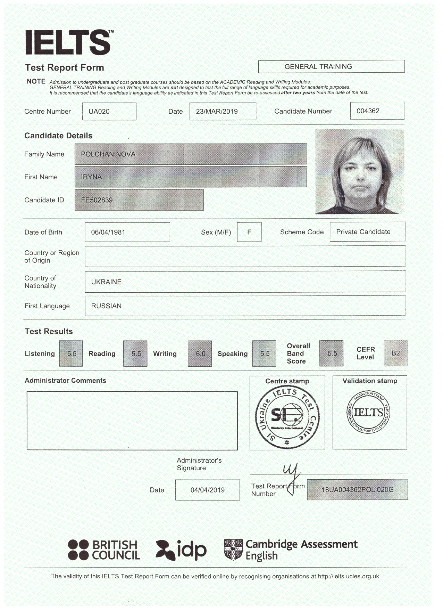

# Iryna Polchaninova

## Contact

**Phone:** +380939106169

**Discord:** ipolchanin#3836

**Telegram:** t.me/PolchaninovaIrina

**Email:** ira.polchanin@gmail.com

**GitHub:** https://github.com/IraPolchanin

**Skype:** live:.cid.7f4338400c48f5cc

---

## Briefly About Myself

Creative and self-starting Front-End Developer with one year experience building stable websites and apps in fast-paced, collaborative environments. Proficient in HTML, CSS, JavaScript and GitHub; plus modern libraries and frameworks as Bootstrap etc. Passionate about usability and possess working knowledge of coding.

---

## Skills and Proficiency
* HTML, CSS
* JavaScript
* API
* GIT, GitHub
* Bootstrap
* Hosting
* Flexbox
* SEO
* Responsive design
* React
* Figma
  
---

## Code example:
**KATA from CODEWARS:** Make a simple function called greet that returns the most-famous "hello world!".
```
function greet(){
  return "hello world!";
}
```
---

## Projects
[Little Lemon restourant](https://dainty-malabi-980256.netlify.app/)

[Dictionary](https://delicate-meringue-8e6586.netlify.app/)

[Weather forecast](https://dainty-gingersnap-d0fc05.netlify.app/)

[Portfolio](https://fluffy-seahorse-71196e.netlify.app/index.html)

---
## Education
1. *University* O.M.Beketov National University of Urban Economy in Kharkiv *Faculty* Productive forces development and regional economy, PhD in economics, 2014.
2. *University* Kharkiv National Academy of Urban Economy *Faculty* Management, master in management, 2003.
3. [*SheCodes Workshops*](https://www.shecodes.io/graduates/44131-iryna-polchaninova)
4. [*Meta Front-End Developer*](https://www.coursera.org/professional-certificates/meta-front-end-developer) (in progress)
5. RS Schools Course «JavaScript/Front-end. Stage 0» (in progress)
   
---

## Languages:
* Ukrainian -  Native
* English - Intermediate/Upper-intermediate
  -1.png)
  


